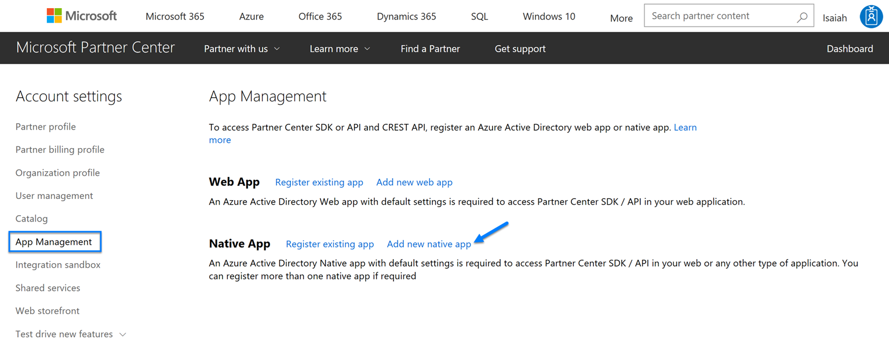
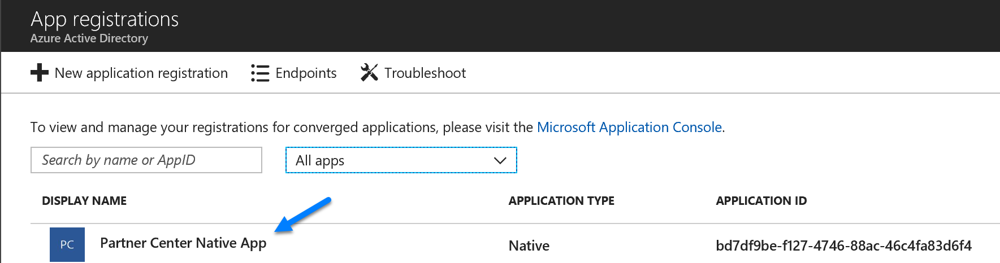
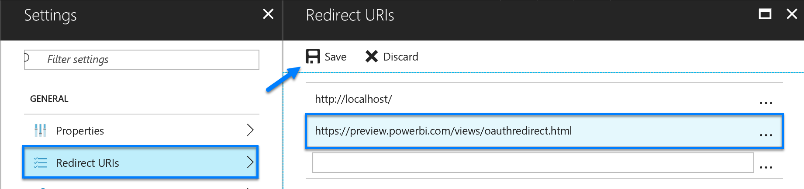

# Partner Center Query
Microsoft Cloud Solution Providers can manage customer accounts, place orders, manage subscriptions, and handle support requests through 
[Partner Center](https://partnercenter.microsoft.com). All these operations can be performed programatically through the use of the 
[Partner Center API](https://apidocs.microsoft.com/services/partnercenter). Having the ability to visualize the data available from the 
Partner Center API can prove to be extremely benefical. This sample project demonstrates how to construct a [data connector](https://powerbi.microsoft.com/en-us/blog/data-connectors-developer-preview/) 
that securely communicates with the Partner Center API. 
 
## Dependencies 

Must be a direct partner or indirect provider. Indirect resellers cannot access the Partner Center API.
 
[Power Query SDK](https://marketplace.visualstudio.com/items?itemName=Dakahn.PowerQuerySDK)

## Walkthrough

This solution requires a native Azure AD application configured to enable access to the Partner Center API. One of the easiest ways 
to create this application is through Partner Center. Perform the following to create the application 

1. Browse to https://partnercenter.microsoft.com and authenticate using credentials with *AdminAgent* and *Global Admin* privileges
2. Click *Dashboard* -> *Account Settings* -> *App Management*
3. Click *Add new native app*

User authentication is required to access the API. Since this is a requirement the following must be specified as a valid redirect
URI for the native application: https://preview.powerbi.com/views/oauthredirect.html. Perform the following to configure this value 

1. Browse to https://aad.portal.azure.com and authenticate using credentials associated with your reseller tenant that have *Global Admin* privileges
2. Click *More Serivces* -> *App registrations* and then locate the native application 

3. Add https://preview.powerbi.com/views/oauthredirect.html as valid redirect URI

